<p align="center">
  <a href="https://winchxyz.github.io/spiralist/">
    <picture>
      <source media="(prefers-color-scheme: dark)" srcset="docs/banner-dark.png">
      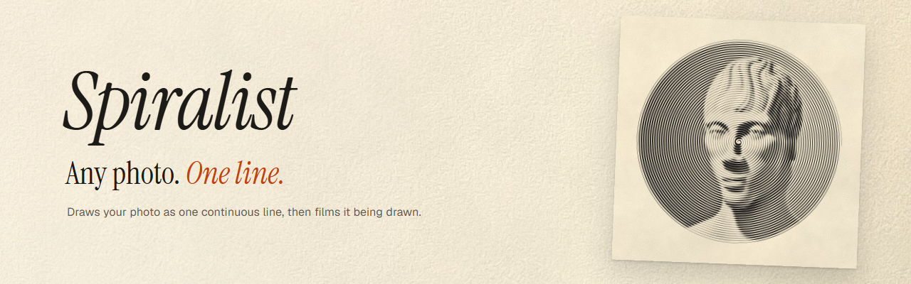
    </picture>
  </a>
</p>

<p align="center">
  <b>Spiralist redraws any photo as one continuous line, in pen, pencil, ink or paint on paper that looks real.<br>
  Then it films the line being drawn.</b>
</p>

<p align="center">
  <a href="https://winchxyz.github.io/spiralist/"></a>
  <a href="https://github.com/winchxyz/spiralist/stargazers"></a>
  <a href="https://x.com/winchxyz"></a>
  <a href="LICENSE"></a>
</p>

<p align="center">
  <a href="https://winchxyz.github.io/spiralist/">
    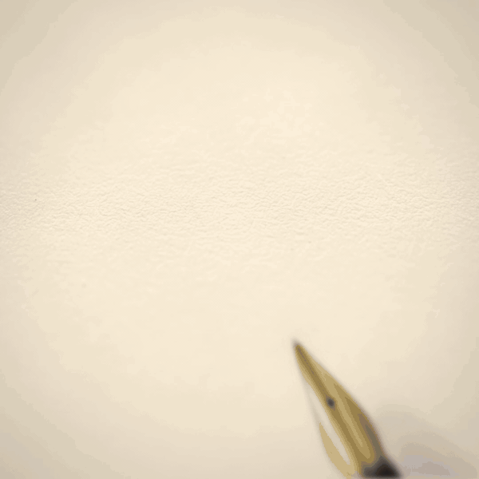
  </a>
  <br>
  <sub>A 10-second film straight out of the app, played 1.3× faster here. Fountain pen on cream paper, Nero marble desk.</sub>
</p>

Everything runs in your browser. Your photo is never uploaded, and after the first visit the site
works offline. Line art needs one extra download the first time you use it (about 45 MB), and then
it works offline too.

## What it does

- **Three modes.** Artistic draws tone with the width of the line, Realistic draws it with how
  densely one real pen packs the line, and Line art leaves tone out and draws the contours, the way
  a person does a continuous-line drawing.
- **Four paths for the line.** Spiral, Wander, Contour and Maze. The line never lifts off the
  paper, and Wander and Maze start wherever you tap.
- **Twelve drawing media that behave like the real thing.** Fountain ink and watercolour soak into
  the paper, bleed along its fibres and dry with darker edges. Charcoal and crayon catch the
  paper's tooth. Graphite shines at a low light, and gold flashes as the light moves.
- **Realistic mode.** Four plotter styles drawn with one pen at its real width, on a sheet of a
  real size. You could draw the result by hand, and the app tells you how long it would take.
- **Line art mode.** Four one-line drawing styles, from a few bold marker lines to a brush with
  hatching. The line goes feature by feature and travels by going back over itself, like a hand
  that never lifts the pen.
- **A loupe.** Zoom in until you see the paper's fibres, with a scale bar in millimetres.
- **Cinematic films.** A macro of the nib touching the paper, a slow pull back, and the finished
  sheet on one of eight desks. Sign it with your name, then share it or post it on X.
- **Exports.** PNG up to 8K, SVG in real millimetres for pen plotters, or straight to the clipboard.

## Line art

The other two modes turn light and dark into line. Line art doesn't draw tone at all. It draws the
way continuous-line artists do: only the contours that matter, one feature at a time. On a face it
starts at the brow or an eye and leaves the hair for last. To get from one feature to the next
without lifting the pen, it goes back over line it has already drawn. The line is short, sure of
itself and a little imperfect, and a nib or a brush swells where the hand slows down.

<p align="center">
  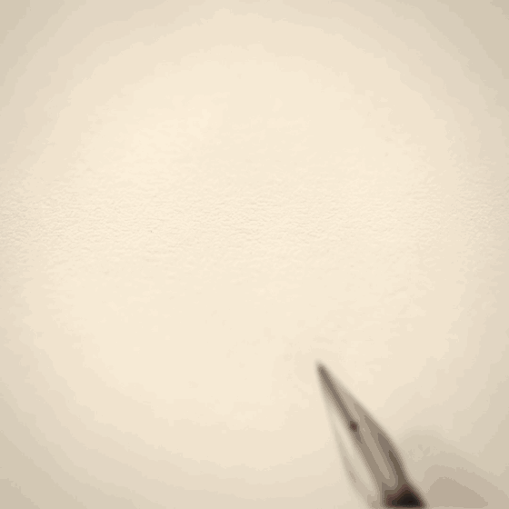
  <br>
  <sub>A 30-second Line art film in style B, straight out of the app. The nib lands at real speed, then the film<br>runs about 5× faster than the hand through the face. The GIF plays the hair 3× quicker again: 1 min 48 s of drawing by hand.</sub>
</p>

<p align="center">
  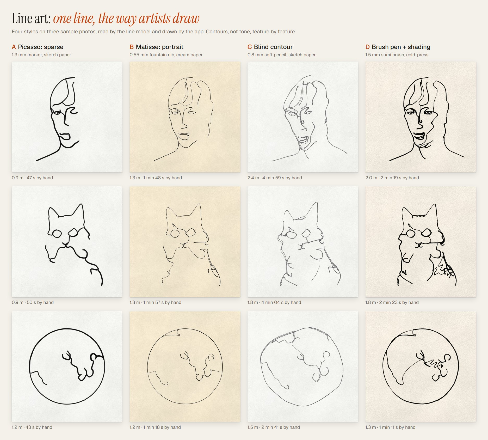
</p>

- **A Picasso: sparse.** A 1.3 mm marker and the fewest lines: a few confident contours and a lot
  of white paper. Under a minute by hand.
- **B Matisse: portrait.** A 0.55 mm fountain nib on cream paper. The features and a few lines of
  hair, in a line that swells where the hand slows. One to two minutes.
- **C Blind contour.** A soft 0.8 mm pencil, drawn as if the eyes stayed on the model and not on the
  paper: the line drifts, loops and misses a little. The slowest, three to five minutes.
- **D Brush pen + shading.** A 1.5 mm sumi brush on cold-press paper, pressed harder and lighter as
  it goes, with a few loose hatches where the subject is darkest, all in the same line. One to
  two and a half minutes.

The names describe a kind of line, not copies of anyone's drawings.

- **How it reads the photo.** A small neural network trained to make line drawings finds the lines
  worth drawing, and a face finder locates the eyes, nose and mouth so a portrait gets them.
  It reads shapes, not tones, so frame the face or subject to fill the square. Faces, animals and
  objects work best; landscapes come out as loose bands of line. A photo with no clear contours
  gets a note saying so, not a made-up drawing.
- **Tools at their real widths.** Fineliner, ballpoint, fountain nib, soft pencil, sumi brush,
  marker and charcoal pencil on a 21 × 21 cm sheet, with your choice of paper and light. Sliders
  for detail, hatching and wobble.
- **Films on the hand's clock.** The pen draws in the planned order, pauses where the artist would
  look up at the model, and rides over the line where it retraces. A 30-second film shows a
  2-minute drawing about 5× faster than the hand, and a drawing shorter than the film is drawn at
  real speed.
- **Exports.** A PNG of the sheet, and an SVG with one path at the tool's real width. For the nib,
  the pencils and the brush, "Filled outline" keeps the swell of the line.
- **First use.** The line model, the face finder and the runtime that runs them are downloaded once,
  the first time you open Line art: about 45 MB (57 MB in browsers that run it on WebGPU). The
  service worker keeps them, so Line art works offline after that. Reading a photo takes about 10
  to 30 seconds. It all runs in your browser, so the photo still never leaves your device. If the
  model can't load, a simpler edge finder reads the photo instead, the app tells you the lines
  will be rougher, and it tries the model again a little later.

## The app

<p align="center">
  <picture>
    <source media="(prefers-color-scheme: dark)" srcset="docs/app-desktop-dark.png">
    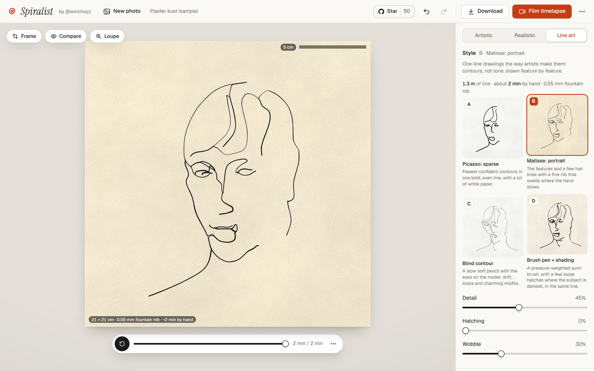
  </picture>
</p>

<table>
  <tr>
    <td width="36%" valign="top">
      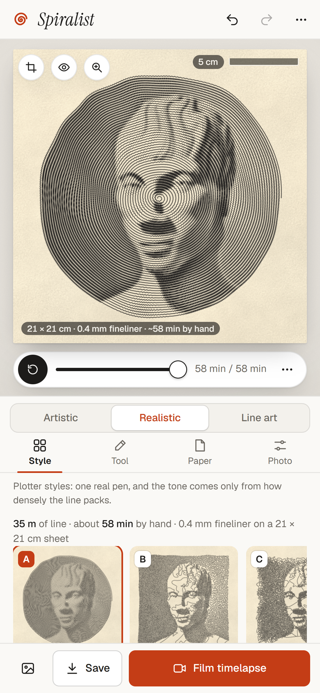
      <br><sub>On a phone, in Realistic mode.</sub>
    </td>
    <td width="64%" valign="top">
      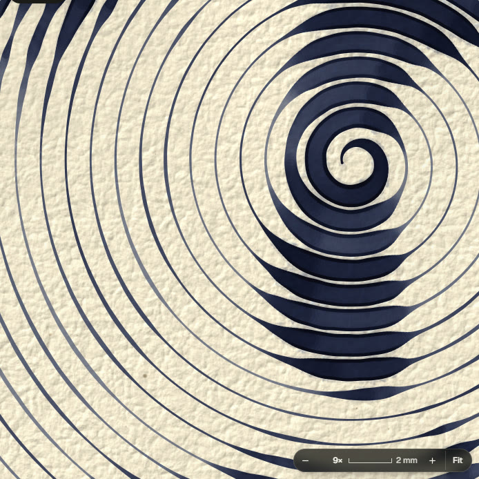
      <br><sub>The loupe at 9×. Fountain ink sitting in the paper's tooth; the bar is 2 mm.</sub>
    </td>
  </tr>
</table>

## Twelve media

Each tool has its own inks and its own way of meeting the paper. The same photo and the same spiral
look completely different in each one.

<p align="center">
  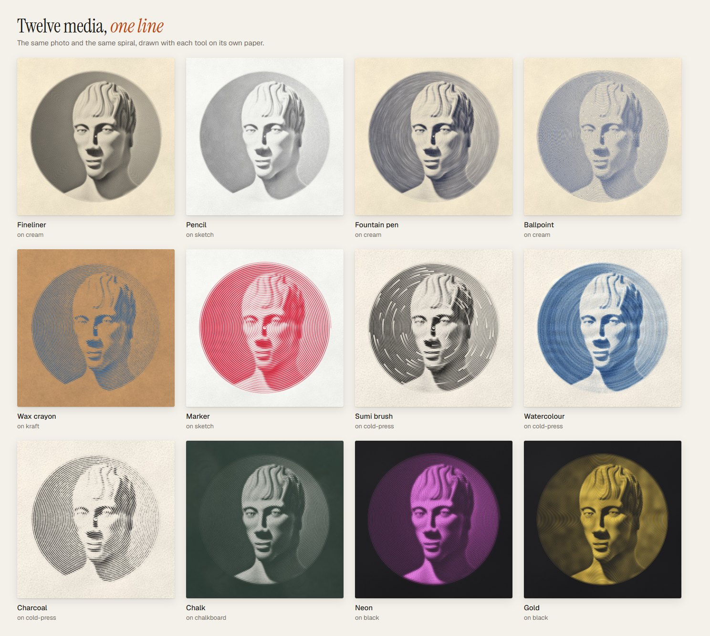
</p>

- **Wet media** (fountain pen, watercolour, sumi brush, marker) run on a small fluid simulation on
  the paper: water and pigment spread, wick along the fibres, pool where the pen slows down and dry
  with darker rims. Very wet paper buckles a little.
- **Dry media** (pencil, charcoal, crayon, chalk) are shaped by the paper's surface: they only
  touch the high points of the grain, so the valleys stay pale.
- **Papers**: sketchbook, cream, cold-press watercolour, kraft, black card, chalkboard and
  blueprint. The grain in the preview matches the grain in a 4K print.

## Realistic mode: plotter styles

The Artistic mode makes the line thicker where the photo is dark. Realistic mode doesn't: it gives
you **one pen at its real width** and a **sheet of a real size**, and the only way to make a dark
area is to draw more line there. Its four styles come from pen-plotter and computational drawing,
where tone comes only from how densely the line packs. A patient person could draw them by hand,
and the app tells you how long that would take.

<p align="center">
  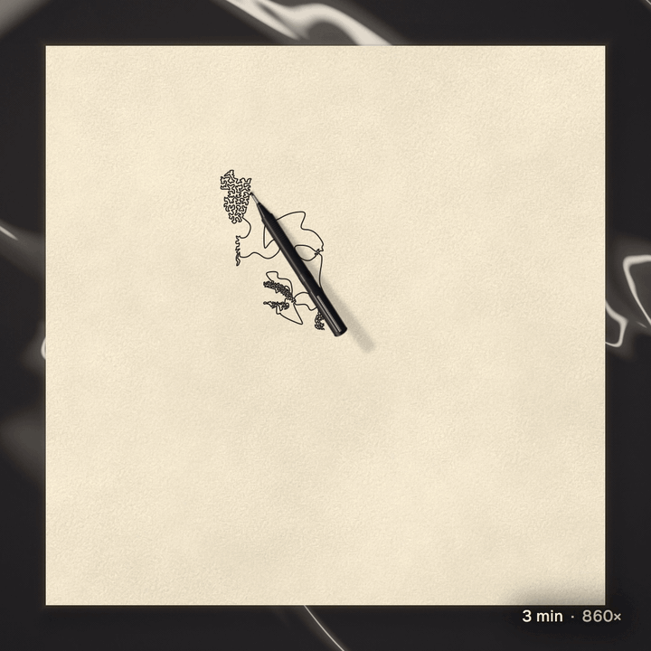
  <br>
  <sub>The pen follows the real line in its real order, and the counter shows the time a hand would need.<br>A flat film on Nero marble; the GIF skips its first three seconds, where the pen lands at real speed.</sub>
</p>

<p align="center">
  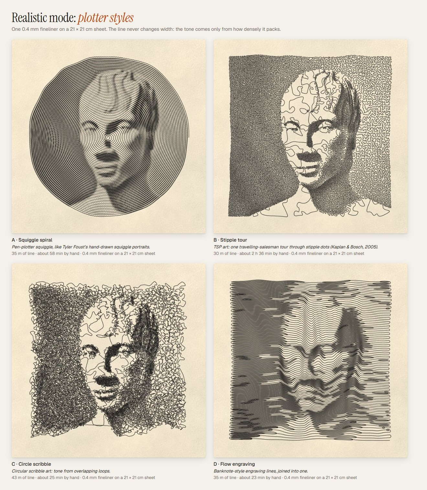
</p>

- **Four styles, each from a real tradition**:
  - **A Squiggle spiral**: the pen-plotter squiggle, like Tyler Foust's hand-drawn squiggle
    portraits. One spiral from the centre that zigzags tighter where the photo is dark.
  - **B Stipple tour**: TSP art (Kaplan & Bosch, 2005). One travelling-salesman tour through
    thousands of stipple dots, packed where it is dark.
  - **C Circle scribble**: circular scribble art. Circling loops that pile up in the shadows.
  - **D Flow engraving**: banknote-style engraving lines, joined into one. Long parallel strokes
    that bend over the form.
- **Real tool sizes**: fineliners from 0.3 to 0.8 mm, ballpoint, fountain pen, pencil, gold paint
  pen, marker, sumi and watercolour brushes, a 4 mm charcoal stick, wax crayon and 5 mm chalk.
- **Sheets that fit the tool.** A 4 mm charcoal stick can't draw a face on A4, so the app picks a
  sheet big enough, up to 2 m across. You can also pick one yourself.
- **Honest numbers**: metres of line and hours by hand for every drawing, plus Window, Raking and
  Overhead light.
- **Never cut short.** A fine pen on a big sheet can need more line than one drawing holds
  (1.4 million points). The line is then drawn with fewer points where it runs straight. If that
  is still not enough, the drawing gets less detail (fewer rings, dots or bands, bigger loops, or
  a Masterpiece drawn as Detailed), and the app tells you. How much line a sheet needs depends on
  the photo: a very dark one can lower detail even on a sheet the tool is offered, and the sheet
  list marks those sizes ("less detail with this photo"). The whole photo is always drawn.
- **The SVG is a real plotter file**: one path, the sheet's real size in millimetres, and the
  stroke as wide as the pen.

## Films

<p align="center">
  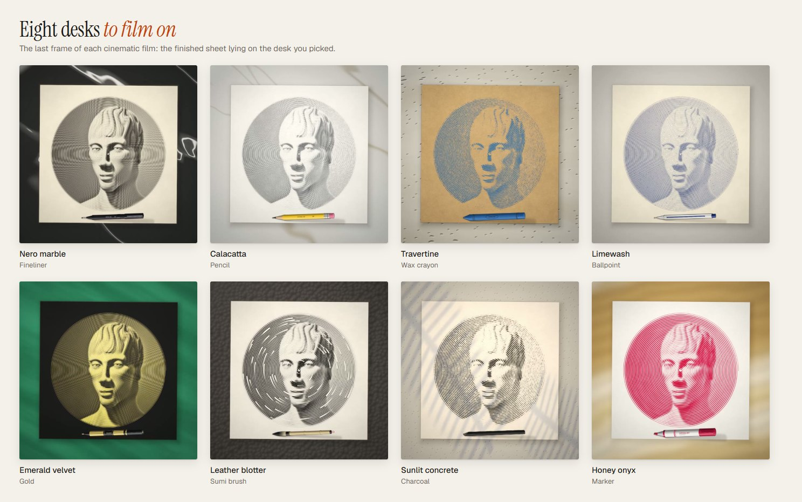
</p>

- **Cinematic or flat.** Cinematic films open on a macro of the nib, pull back with depth of field and
  a moving light, and end on the whole sheet on a desk.
- **Eight desks**: Nero marble, Calacatta, Travertine, Limewash, Emerald velvet, Leather blotter,
  Sunlit concrete and Honey onyx.
- **Sign it**: type your name or @handle and the pen signs the corner at the end, in the same ink.
- **Realistic and Line art films** show the true drawing, sped up: the pen moves at a believable
  hand speed with a clock in the corner, and nothing is faded in or revealed. In Line art the pen
  also pauses where the artist looks up at the model, and the film never runs slower than the hand.
- 9:16, 4:5, 1:1 or 16:9, 10 to 60 seconds (15, 30 or 60 in Line art), 30 or 60 fps, saved as an
  H.264 MP4. On a phone you can
  share it straight to your apps. **Post on X** shares the video on phones, and on desktop it opens a
  post and saves the video for you to attach.

Full-quality MP4s of the films above are on the [Releases page](https://github.com/winchxyz/spiralist/releases).

## How it works

1. **Photo to tone.** The photo is turned into a map of light and dark, with automatic levels
   so the face reads well. You can crop, rotate and adjust it.
2. **Tone to one line.** A path generator walks that map and lays down a single line. The
   spiral widens in the dark areas. The Realistic styles keep the width fixed and pack the line
   tighter instead: denser zigzags, a closer tour, more loops or more engraved lines.
3. **Line to marks on paper.** The line is drawn with WebGL 2 as a physical mark: the paper has a
   height map and fibres, each medium has its own rules for how it meets them, and wet media run a
   small simulation of water and pigment on a grid over the sheet.
4. **Marks to film.** A film is rendered frame by frame, not recorded from the screen. A virtual
   camera and light move over the desk, and the frames are encoded to MP4 in the browser.

In Realistic mode, each style also works out how fast a hand would move along its line (slower in
tight curves and dense patches). That clock drives the playback, the film's counter and the
"by hand" estimate.

Line art takes a different road from step 1:

1. **Photo to lines.** A small neural network trained to make line drawings (Informative
   Drawings) turns the photo into a line drawing, and MediaPipe's Face Landmarker finds the eyes,
   brows, nose and mouth. The model runs in a Web Worker with onnxruntime-web, and the face finder
   runs on the page; both run on your device.
2. **Lines to strokes.** The drawing is traced into strokes, and each stroke is tagged with the
   feature it belongs to (brow, eye, nose, lips, jaw, ear, hair or outline) where the face
   landmarks say so.
3. **Strokes to one line.** Each style picks the strokes it wants and plans an order, feature by
   feature. The pen gets from one stroke to the next by going back over drawn line where it can,
   and by a short link where it can't. The hand gets a clock, slower in curves and with a short
   look at the model before each new feature, and nibs and brushes get their pressure from it.

That clock drives the playback, the film and the "by hand" time, just as in Realistic mode.

## Run locally

It's a static site with no build step and no dependencies to install:

```bash
git clone https://github.com/winchxyz/spiralist.git
cd spiralist
node dev-server.js 8830
```

Then open <http://localhost:8830>. You need a browser with WebGL 2 (current Chrome, Edge, Safari
or Firefox). Films use WebCodecs where the browser has it and fall back to MediaRecorder.

### Keyboard

| Key | Does |
|---|---|
| `M` | next mode: Artistic, Realistic, Line art |
| `1`–`9` | pick a look (Artistic) |
| `1`–`4` | pick style A–D (Realistic and Line art) |
| `[` `]` | fewer or more rings (Artistic), less or more detail (Realistic and Line art) |

## Tech

- Vanilla JavaScript ES modules. No framework, no bundler, no build step.
- WebGL 2 for the drawing, the paper and the wet-media simulation; Web Workers build the
  Realistic and Line art lines.
- Line art runs a line-drawing model with onnxruntime-web (WebGPU where the device has it,
  otherwise WebAssembly) and MediaPipe's Face Landmarker. Both are vendored in `vendor/` and load
  only when Line art is first used; the service worker keeps them in their own cache.
- WebCodecs and a vendored MP4 muxer for the films.
- Runs entirely in the browser, and a service worker keeps it working offline. The photo never
  leaves your device.

### Code map

| Path | What |
|---|---|
| `js/tone.js` | photo → tone map (levels, detail, auto midtones) |
| `js/spiral.js`, `js/freeline.js`, `js/maze.js` | tone → one line: spiral, wander and contour, maze |
| `js/lineart/` | Line art mode: the four styles (`styles.js`), the engine and its cache (`index.js`), reading the photo with the model and the face finder (`lines.js`, `worker.js`), tracing strokes (`strokes.js`), and planning the one line and the hand's clock (`path.js`, `buildworker.js`) |
| `js/real/` | Realistic mode: the four styles (`squiggle`, `stipple`, `scribble`, `engrave`), sheet sizes and hand time (`index.js`), and the worker that builds them (`builder.js`, `worker.js`) |
| `js/renderer.js`, `js/shaders.js`, `js/brushes.js`, `js/papers.js` | the WebGL 2 renderer, the media and the papers |
| `js/wetsim.js` | the wet media simulation (water, pigment, fibres, buckling) |
| `js/loupe.js` | the zoom loupe |
| `js/film.js`, `js/scene.js`, `js/desks.js`, `js/signature.js`, `js/encoder.js` | film timeline, camera and desks, signature, video encoding |
| `js/export.js`, `js/download.js`, `js/share.js` | PNG and SVG export, sharing to X |
| `js/materials.js` | looks, and the Realistic and Line art tools at their real sizes |
| `vendor/` | the MP4 muxer, and the Line art model, face finder and runtime (sources, sizes and licences in [`vendor/LICENSES.md`](vendor/LICENSES.md)) |
| `js/app.js` | the app itself |
| `js/tools.js`, `js/samples.js` | pen sprites and the built-in sample photos |
| `dev/`, `tests/` | visual labs and tests |

### Tests

```bash
node tests/geometry.test.mjs
node tests/brush.test.mjs
node tests/papers.test.mjs
node tests/scene.test.mjs
node tests/export.test.mjs
node tests/real.test.mjs
```

The browser tests (`tests/intake.e2e.mjs`, `tests/film.e2e.mjs`, `tests/film.dialog.e2e.mjs`,
`tests/film.lineart.mjs`, `tests/real.e2e.mjs`, `tests/loupe.e2e.mjs`, `tests/app-shot.mjs`) drive
the running dev server with Playwright. The visual labs live in `dev/`, including the Line art
line-up (`dev/lineart_lineup.html`).

## Credits

Made by [@winchxyz](https://x.com/winchxyz) with [Claude Code](https://claude.com/claude-code).

Line art stands on other people's work:

- **Informative Drawings**, the line-drawing model: Caroline Chan, Frédo Durand and Phillip Isola,
  "Learning to generate line drawings that convey geometry and semantics", CVPR 2022
  ([code and weights](https://github.com/carolineec/informative-drawings), MIT). The ONNX
  conversion is by Joseph Rocca ([image-to-line-art-js](https://github.com/josephrocca/image-to-line-art-js), MIT).
- **MediaPipe Face Landmarker** by Google
  ([docs](https://ai.google.dev/edge/mediapipe/solutions/vision/face_landmarker), Apache-2.0).
- **ONNX Runtime Web** by Microsoft ([onnxruntime](https://github.com/microsoft/onnxruntime), MIT).

The Realistic styles follow pen-plotter and computational drawing traditions: Tyler Foust's
squiggle portraits, TSP art (Craig S. Kaplan and Robert Bosch, "TSP Art", Bridges 2005), circular
scribble art and banknote engraving.

## License

MIT, see [LICENSE](LICENSE). `vendor/mp4-muxer.mjs` is © Vanilagy (MIT). The Line art model,
MediaPipe and onnxruntime-web files in `vendor/` keep their own licences (MIT and Apache-2.0),
listed with their sources in [`vendor/LICENSES.md`](vendor/LICENSES.md).
